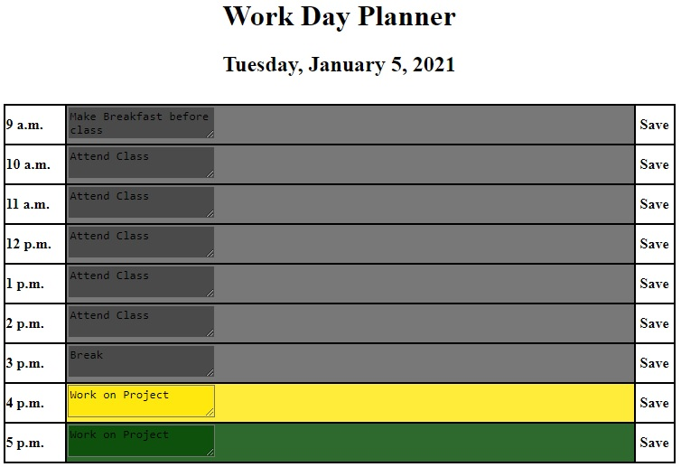

Daily Planner
====
Staying organized is hard. There are only so many hours in the day and even fewer of those hours spent at work. For those who work from home, disorganization or inefficiency could find you "at work" for much longer than need be. These issues may be able to be addressed simply by planning one's day hour by hour so that one is on-task throughout the day. The simple daily planner created here, aims to solve this issue.


----

## Plan Your Day
Here is an example of a schedule that a student might keep.



The textareas here are color-coded referencing the current time. Hours in the past are grey, whereas the current time is displayed in yellow. The future is green!

----

## How does it know what time it is???

Luxon is a 3rd party API that makes referencing time simple! The API is included in this project repo and directly linked to the index.html.

```
//-- In the <head> of index.html --//
<script src="luxon.js"></script>
// --                            --//


//-- In the script.js file --//
var DateTime = luxon.DateTime;
var time = DateTime.local();
var now = time.toLocaleString(DateTime.DATE_HUGE);

var showTime = $('<h2>').text(now);
$('h1').after(showTime);
//--                      --//
```
The var "now" pulls a formatted date and time from Luxon and appends it to the page as seen in the above example screenshot.

Of course a diligent student would spend even more time studying as in the example above, however this project is made to reflect the average working hours of a 9-5 employee.

----

## But what if I dont work 9-5???
This scheduler can be modified easily to fit any laborer's needs.

```
for (i = 9; i < 18; i++) {
  var tr = $("<tr>");
  var timeSlot = $("<td>");
  var textTd = $("<td>");
  var textArea = $("<textarea>");
  var saveIcon = $("<td>");
  //sets the correct time for each tr
  var timeStr = "";
  if (i == 12) {
    timeStr = i + " p.m.";
  } else if (i > 12) {
    timeStr = i - 12 + " p.m.";
  } else {
    timeStr = i + " a.m.";
  }
  ...
...
}
  ```
For example, if one wanted a 24 hour scheduler all that is needed is to change the for loop.

```
for (i = 0; i < 24; i++)
```
This will give us a 24 hour schedule. Of course there would need to be another conditional statment in the for loop as well accounting for midnight. Simply:
```
if (i == 0) {
    timeStr = "12 a. m.";
}
```
----

## Built Using
* [Luxon](https://moment.github.io/luxon/)
* Jquery
* Javascript
* HTML
* CSS
* Git
* GitHub

----

## Deployed Link
[Daily Planner](https://spenrad.github.io/Daily-Planner/)

----

## Author
Spencer Christy<br>
[GitHub](https://github.com/spenrad)<br>
[LinkedIn](https://www.linkedin.com/in/spencer-christy-543b84b3/)<br>

----

## Acknowledgements
Thank you for reading and now get organzied and be sure to stay on schedule!

